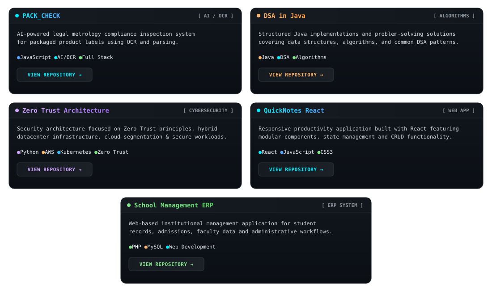
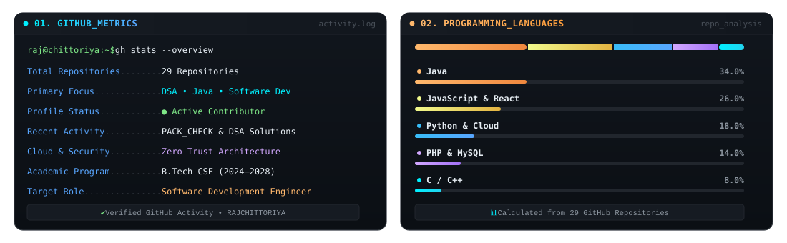

# 👋 Hi, I'm Raj Chittoriya

Computer Science & Engineering student focused on Data Structures & Algorithms, Java, Python, databases, and building practical software projects.

---

## 👨‍💻 About Me

- 🎓 **Undergraduate Student:** Pursuing B.Tech in Computer Science & Engineering at IILM University, Greater Noida (Batch 2024–2028).
- 🧩 **DSA & Problem Solving:** Actively practicing problem-solving and algorithmic thinking primarily in Java.
- 💻 **Software Development:** Building functional, real-world software applications and exploring modern web development.
- 🗄️ **Databases & Systems:** Working with relational database management systems (DBMS), SQL querying, and system fundamentals.
- 🚀 **Hands-on Learner:** Constantly building projects, writing clean code, and exploring emerging software technologies.

---

## 🌐 Connect With Me

---

## 🚀 Featured Projects

---

## 📊 GitHub & Coding Stats

---

## 🛠️ Technical Stack & Skills Arsenal

---

## 🎯 Current Focus

- 🧩 **DSA Problem Solving:** Advancing algorithm efficiency, graph algorithms, dynamic programming, and recursion patterns in Java.
- 🛠️ **Project Development:** Building practical, production-ready software solutions with clean architecture.
- 🗄️ **Database & Backend Systems:** Deepening knowledge in SQL optimization, database indexing, and backend design.
- 📚 **Academic Excellence:** Progressing through core Computer Science curriculum and continuous self-study.

---

## 💡 Developer Philosophy

> *"Build. Break. Debug. Learn. Repeat."*
=======

<!-- Custom Neon SVG Banner (Locally hosted, 100% reliable) -->

<!-- Animated Typing SVG -->

  

  

  

👨‍💻 Full Description & About Me

Hey there! 👋 I am Raj Chittoriya, a tech-driven and passionate Computer Science & Engineering undergraduate at IILM University, Greater Noida (Batch 2024 – 2028), based in Delhi NCR, India.

I thrive at the intersection of logical problem-solving and software engineering. My primary focus lies in mastering Data Structures & Algorithms (DSA), crafting robust Object-Oriented Programming (OOPs) solutions, and architecting efficient Relational Database Management Systems (RDBMS). I continuously sharpen my computational thinking by actively tackling problems on LeetCode and GeeksforGeeks.

Name: Raj Chittoriya

Institution: IILM University, Greater Noida

Degree: Bachelor of Technology (B.Tech) in Computer Science & Engineering

Batch: 2024 - 2028

Location: Delhi NCR, India

Core Specialties:

  - Languages: Java, Python, C/C++, SQL

  - Database Management: MySQL, Relational Database Architecture

  - Concepts: Data Structures & Algorithms (DSA), OOPs, System Logic

  - Tools & Platforms: Git, GitHub, VS Code, Linux, Jupyter Notebook

Hobbies & Interests: Algorithmic puzzles, Tech innovations, Exploring modern dev tools, Coffee & Coding

🎓 Academic Journey: Pursuing B.Tech CSE, consistently building semester-driven projects that solve real operational challenges.

💻 Hands-on Development: Building database-driven platforms and process-automation tools while strengthening programming fundamentals.

🎯 Current Focus: Leveling up on LeetCode & GeeksforGeeks, mastering advanced Java paradigms, and diving deeper into scalable backend engineering.

🤝 Collaboration: Open to collaborating on open-source projects, hackathons, technical teamwork, and developer internships.

⚡ Philosophy: "Simplicity is prerequisite for reliability — write clean, efficient, and intentional code."

🌐 Connect With Me & Coding Profiles

 

 

 

 

⚡ Real-Time Streaks & Problem Solving

<!-- LeetCode Stats -->

<h4>🟠 LeetCode Real-Time Questions Solved & Ranking</h4>

  

<!-- GitHub Streak Stats -->

<h4>🟢 GitHub Live Contribution Streak</h4>

  

<!-- Stats & Top Languages Grid -->

<table align="center" border="0" cellpadding="0" cellspacing="0">

  <tr>

<td align="center" valign="top">

  

</td>

<td align="center" valign="top">

  

</td>

  </tr>

</table>

🛠️ Technical Stack & Skills Arsenal

<!-- Interactive Skill Icons Row -->

 

>>>>>>> 09fbd58d3b328e0cb08d40067e3ae8d688237cdb
