# 👋 Hi, I'm Raj Chittoriya

Computer Science & Engineering student focused on Data Structures & Algorithms, Java, Python, databases, and building practical software projects.

---

## 👨‍💻 About Me

- 🎓 **Undergraduate Student:** Pursuing B.Tech in Computer Science & Engineering at IILM University, Greater Noida (Batch 2024–2028).
- 🧩 **DSA & Problem Solving:** Actively practicing problem-solving, algorithms, and computational thinking primarily in Java.
- 💻 **Software Development:** Building functional, real-world software applications and exploring modern backend & frontend engineering.
- 🗄️ **Databases & Systems:** Working with relational database management systems (DBMS), SQL querying, and schema design.
- 🚀 **Hands-on Learner:** Constantly building projects, writing clean maintainable code, and exploring emerging software technologies.

---

## 🌐 Connect With Me

---

## 📊 GitHub & Coding Stats

---

## 💡 Developer Philosophy

> *"Build. Break. Debug. Learn. Repeat."*

---

  ⭐ <i>Thanks for visiting! Feel free to check out my repositories or connect on <a href="https://www.linkedin.com/in/raj-chittoriya-7179a7322/">LinkedIn</a>.</i>

